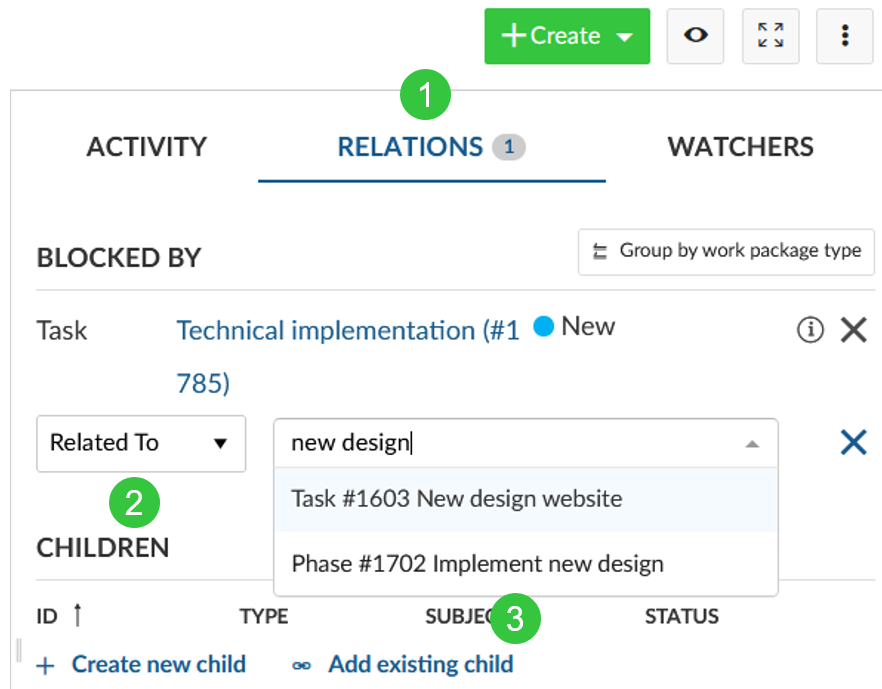
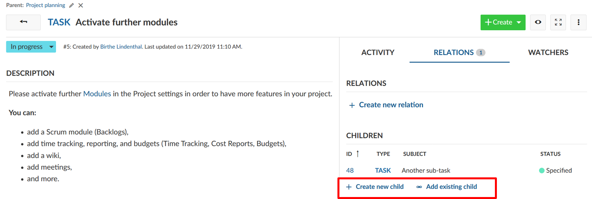
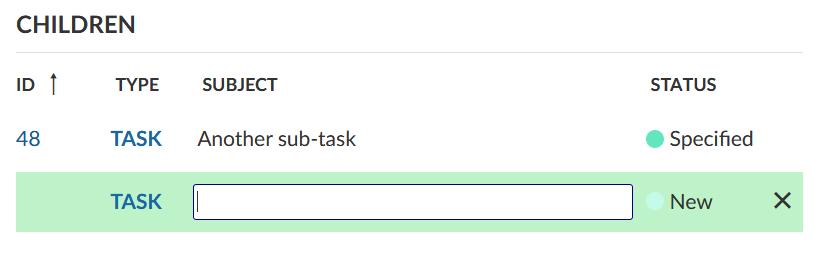
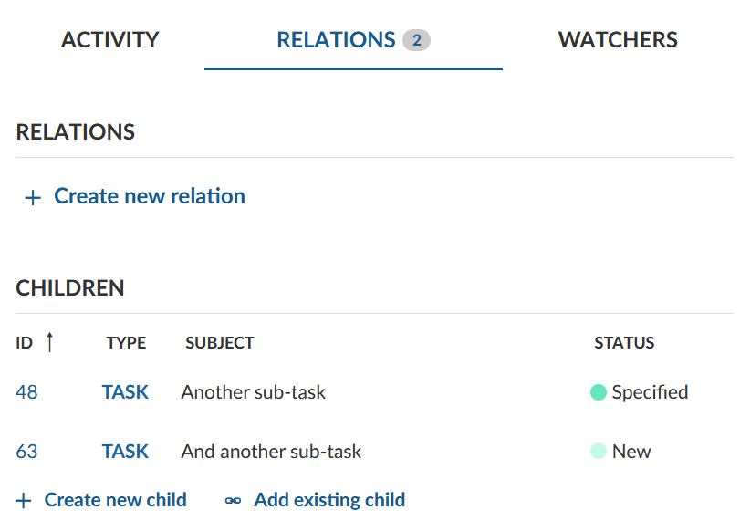
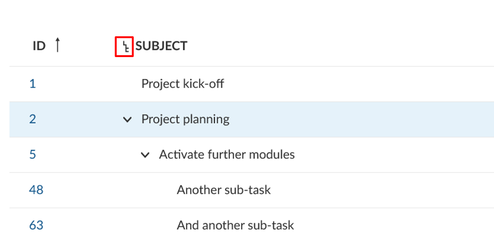
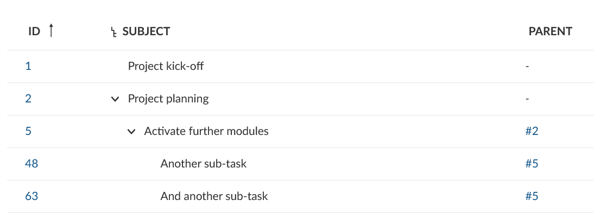

---
sidebar_navigation:
  title: Work package relations and hierarchies
  priority: 600
description: How to add or configure Work package relations?
robots: index, follow
keywords: work package relations, hierarchies, child, parent
---

# Work package relations and hierarchies

You can create work package hierarchies and relations.

Hierarchies are a hierarchical relation (parent-child-relationship) vs. relations indicate any functional or timely relation (e.g. follows or proceeds, blocked by, part of, etc.)

| Topic                                                        | Content                                                      |
| ------------------------------------------------------------ | :----------------------------------------------------------- |
| [Work packages relations](#work-package-relations)           | How can I set a relation between two work packages and which relations can I set? |
| [Display relations in work package list](#display-relations-in-work-package-list-(premium-feature)) | How can I display the relations between two work packages in the work package list? |
| [Work package hierarchies](#work-package-hierarchies)        | What are work package hierarchies? Learn about parent and children work packages. |
| [Adding a child work package](#adding-a-child-work-package)  | What are the possibilities to add children work packages?    |
| [Change the parent work package](#change-the-parent-work-package) | How can I change a work package's parent?                    |
| [Display work package hierarchies](#display-work-package-hierarchies) | Where can I find out about a work package's children and parent? |

## Work package relations

Work package relations indicate that work packages address a similar topic or create status dependencies. To create a relationship between two work packages:

1. Select a work package, click on **Relations** to open the relations tab and click the *+ Create new relations* link.
2. Select the type of relationship from the dropdown menu.
3. Enter the ID or name of the work package, to which the relation should be created and choose an entry from the dropdown menu.
4. If necessary, press the Enter key

You can select one of the following relations:

- **Related to** – This option adds a link from the work  package A to work package B, so that project members can immediately see the connection, even if the work packages are not members of the same  hierarchy. There is no additional effect.
- **Duplicates / Duplicated by** – This option indicates  that the work package A duplicates a work package B in one way or  another, for example both address the same task. This can be useful if  you have the same work package that needs to be a part of a closed and  public projects at the same time. The connection in this case is  semantic, the changes you make in work package A will need to be adapted in work package B manually.
- **Blocks / Blocked by** – This option defines status  change restrictions between two work packages. If you set a work package A to be blocking work package B, the status of work package B cannot be set to closed or resolved until the work package A is closed (in a  clode meta-status).
- **Precedes / Follows** – Defines a chronologically  relation between two work packages.  For example, if you set a work  package A to precede a work package B, you will not be able to change  the starting date of B to be earlier than the end date of A. In  addition, when you move the start or due date of A, the start and due  date of B will be updated as well.
- **Includes / Part of** – Defines if work package A  includes or is part of work package B. This relation type can be used  for example when you have a rollout work package and work packages which should be shown as included without using hierarchical relationships.  There is no additional effect.
- **Requires / Required by** – Defines if work package A requires or is required by work package B. There is no additional effect.

The selected relation status will be automatically displayed in the  work package that you enter. For example if you select “Blocks” in the  current work package A and specify work package B, work package B will  automatically show that it is “Blocked by” A.

## Display relations in work package list (Premium feature)

As a user of the [Enterprise Edition](https://www.openproject.org/enterprise-edition/) or [Cloud Edition](https://www.openproject.org/hosting/) you can display relations as columns in the work package list.

This is useful if you want to get an overview of certain types of  relationships between work packages. You can for example see which work  packages are blocking other work packages.

To add relation columns, open the columns modal and select a relation from the dropdown menu (e.g. “blocked by relations”).

The relations column shows the number of relations each work package has for the relation type (e.g. “blocked by”).

You can click on the number to display the work packages which have the relation type.

        

## Work package hierarchies

Work packages can be structured hierarchically, e.g. in order to break down a large work package into several smaller tasks. This means that there's a parent work package that has at least one child work package.

## Adding a child work package

There are **three ways to add or create a child work package**:

1. Adding or creating a child in the *Relations* tab in a work package's details view
2. Right-clicking on a work package in the work package list and select "Create new child"
3. Right-clicking on a work package in the work package list and select "Indent hierarchy" to add it as the child of the work package above it.

### Adding a child in the *Relations* tab in a work package's details view

Open a work package and select the tab *Relations*. Click on *+ Create new child* to create a child work package. Alternatively, you can assign an existing child work package with *+ Add existing child*.

Insert the name of the new work package and save the newly created work package by pressing *Enter*. You can make changes to the work package by clicking on the work package ID.

For more information on the work package creation take a look at the guideline on [creating a work package](../create-work-package).

## Change the parent work package

To edit or remove the parent of a work package open the work package. At the top of the details view of the work package you will see the work package hierarchy. Click on the Edit or delete icon to change the work package parent.

## Display work package hierarchies

After adding the parent and child work packages they are listed in the *Relations* tab.
Note that only the direct parent and children are shown in the relations tab.

Hierarchies can also be displayed from the work package list view.
To display work package hierarchies make sure the *Subject* column is displayed. You can activate or deactivate the hierarchy by pressing the icon next to the Subject.

You can also add a column with information about parent work packages:

1. In the work package settings menu, click on *Columns*.
2. Use auto-completion to search and add the *Parent* column.
3. Click on *Apply* to display the new parent column in the work package list.

